# TESLO SHOP App

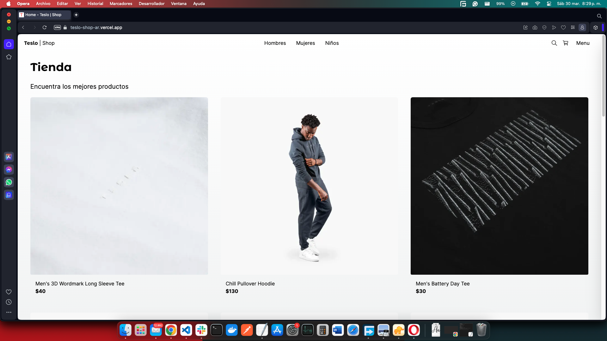
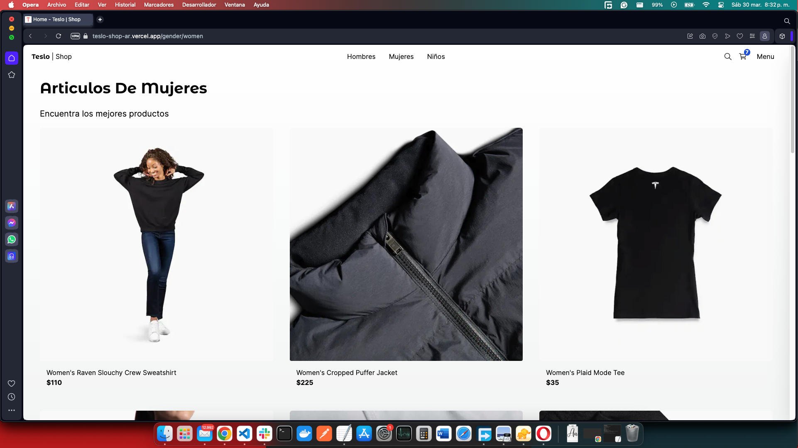
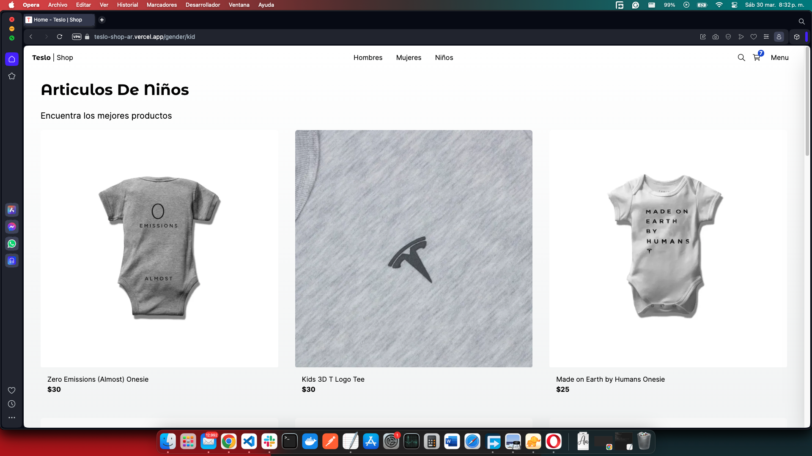
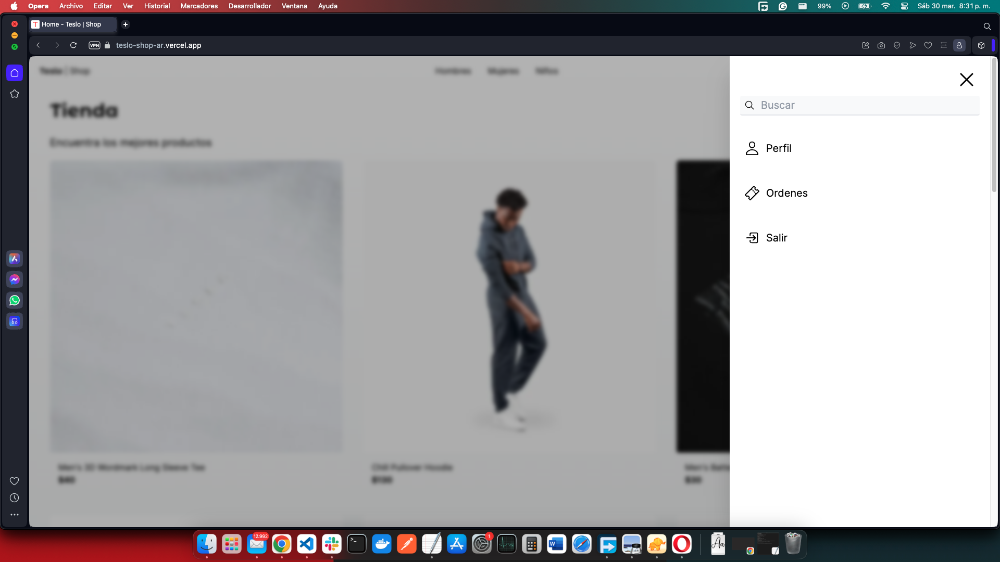
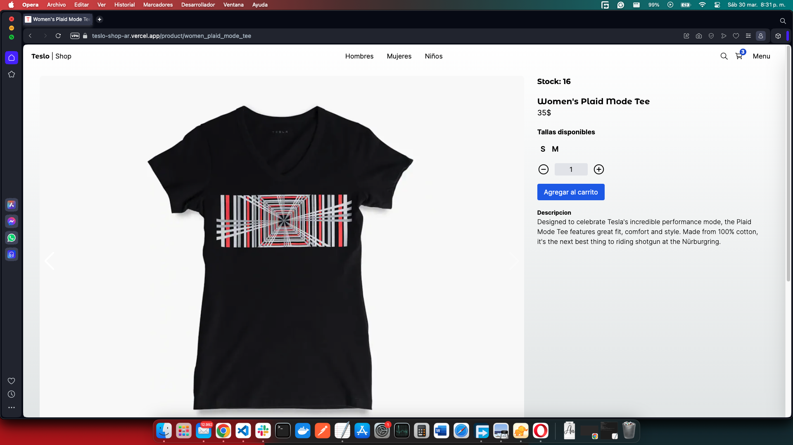
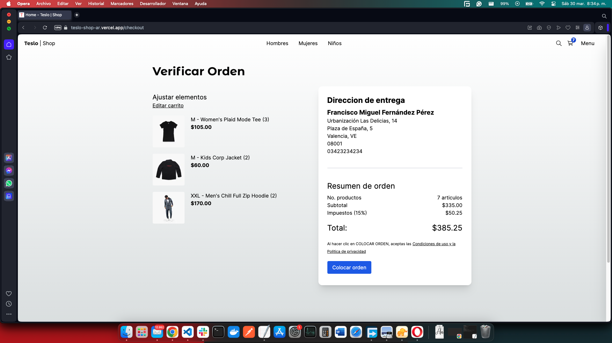
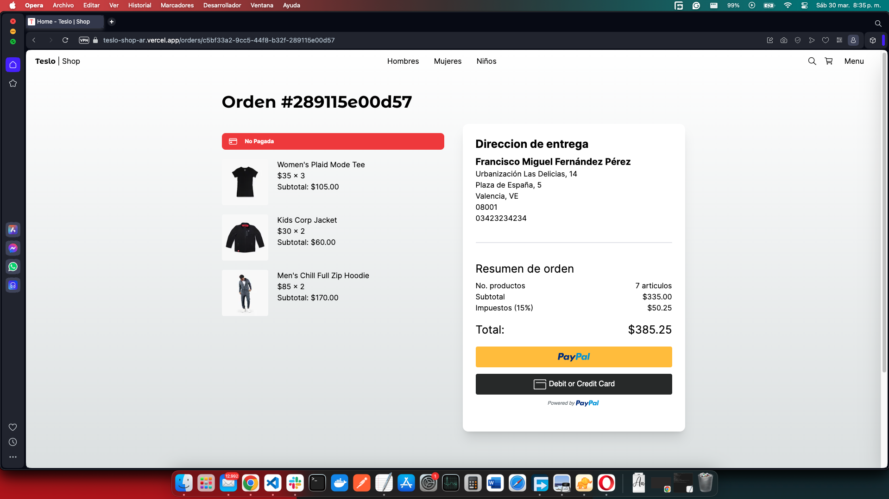
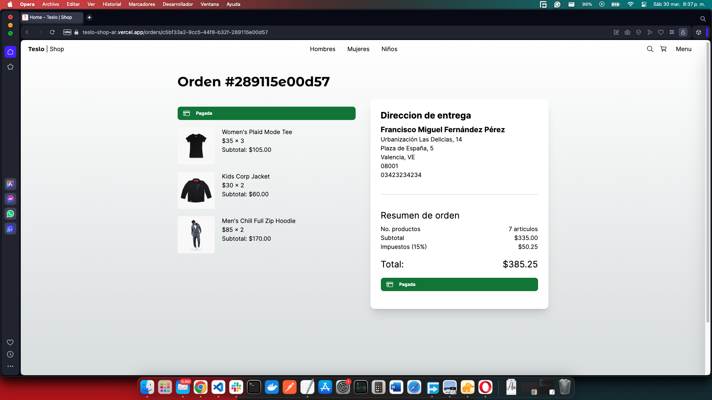
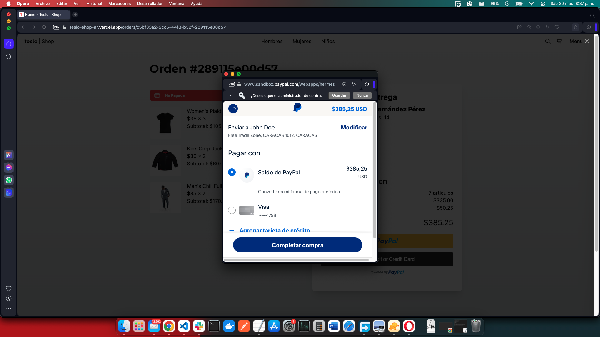
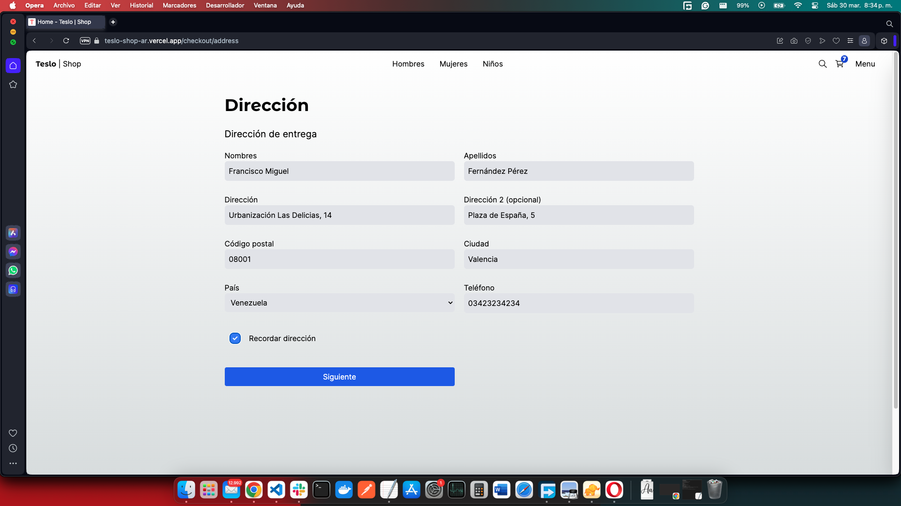
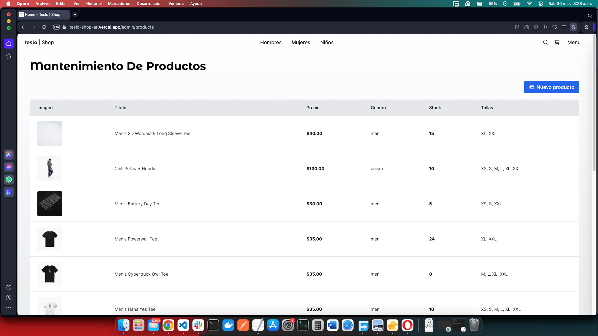
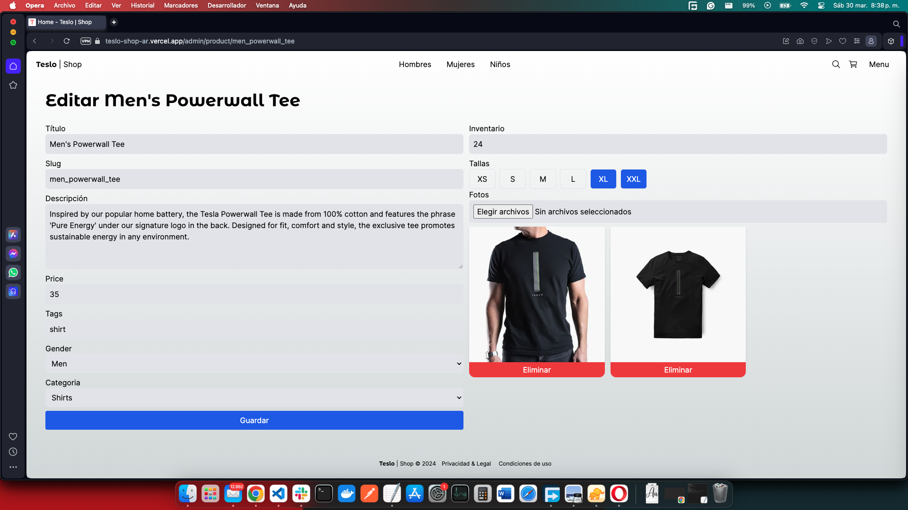
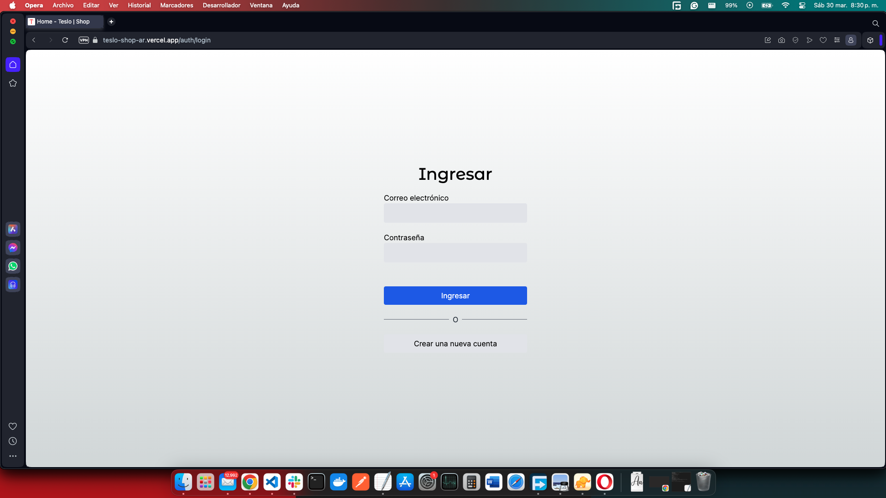

# Descripcion

## Correr en DEV

1. Clonar el repositorio
2. Instalar dependencias `npm install`
3. Levantar la base de datos con docker-compose.yaml
4. Correr las migraciones de Prisma `npx prisma migrate dev`
5. Ejecutar seed `npm run seed`
6. Limpiar el locarlStorage del navegador
7. Correr el proyecto `npm run dev`

